# 袖珍网盘吧 OSS 版（前端）

#### 介绍
本项目通过设计与开发一个小巧实用的个人网盘，轻松管理上传的文件，在线预览一些常见媒体文件，实现文件的快速共享功能。主要功能包括：登录注销、文件管理、文件回收站、文件在线预览、文件共享、邮件发送等。

#### 链接
袖珍网盘吧 OSS 版：[http://cloud.yongkj.cn/](http://cloud.yongkj.cn/)

#### 截图

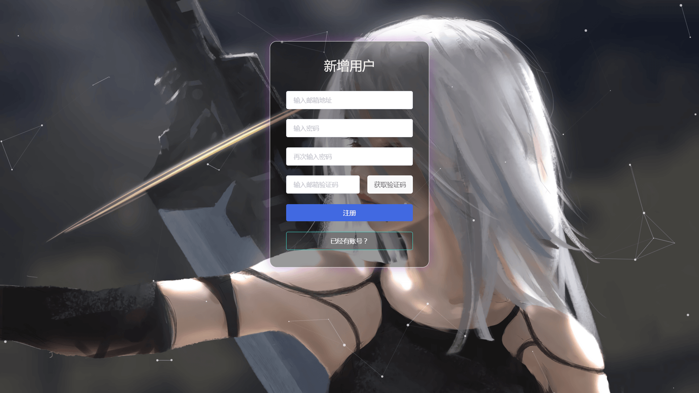

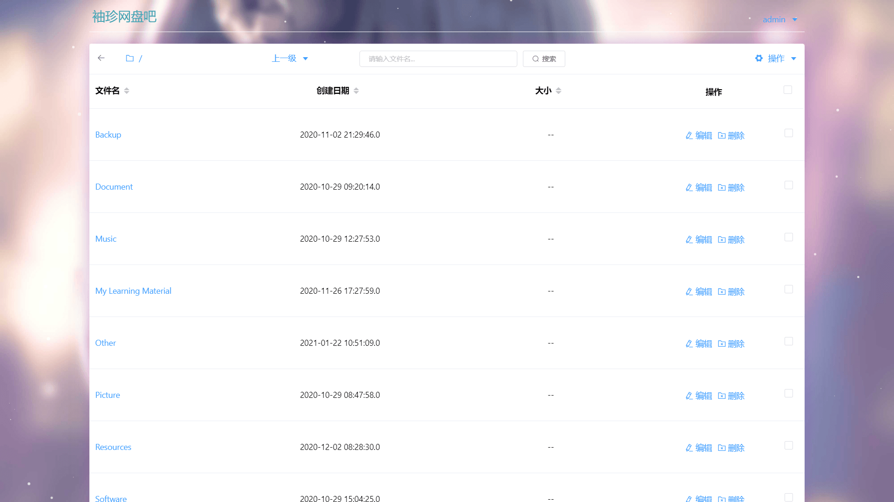

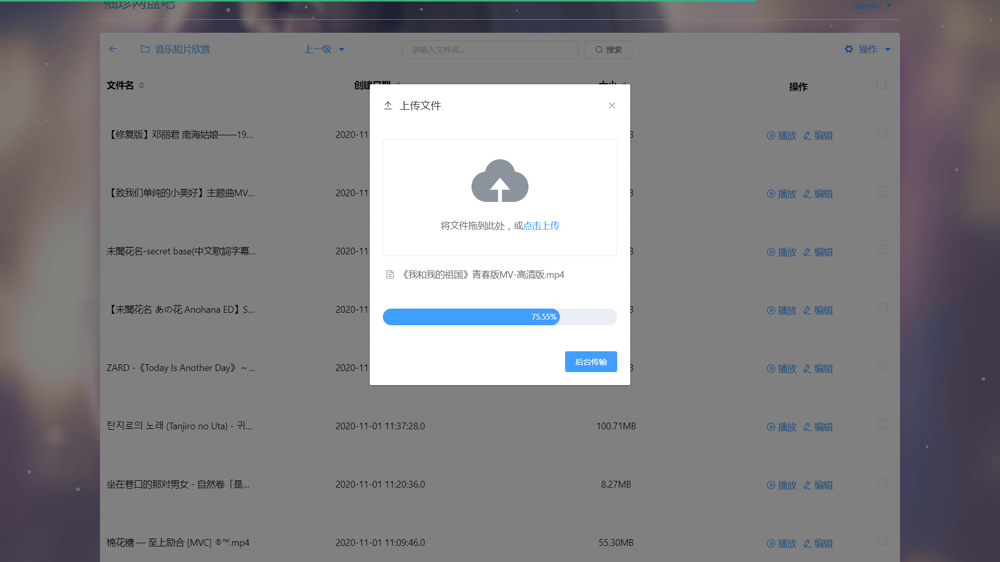

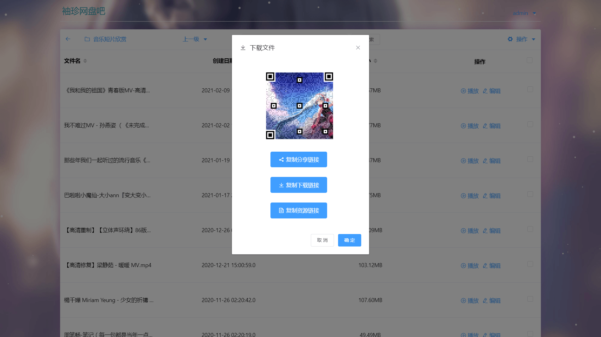

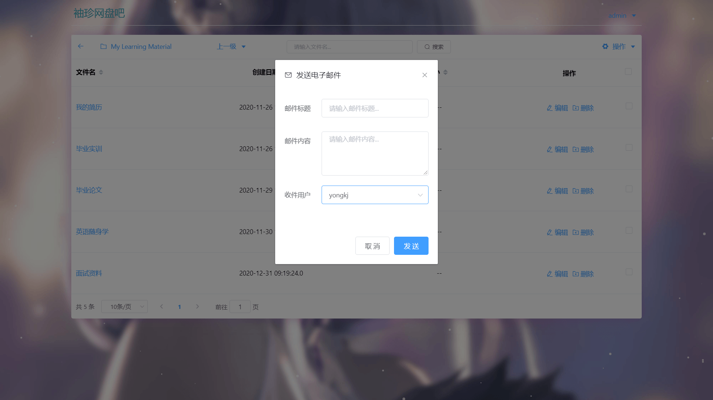

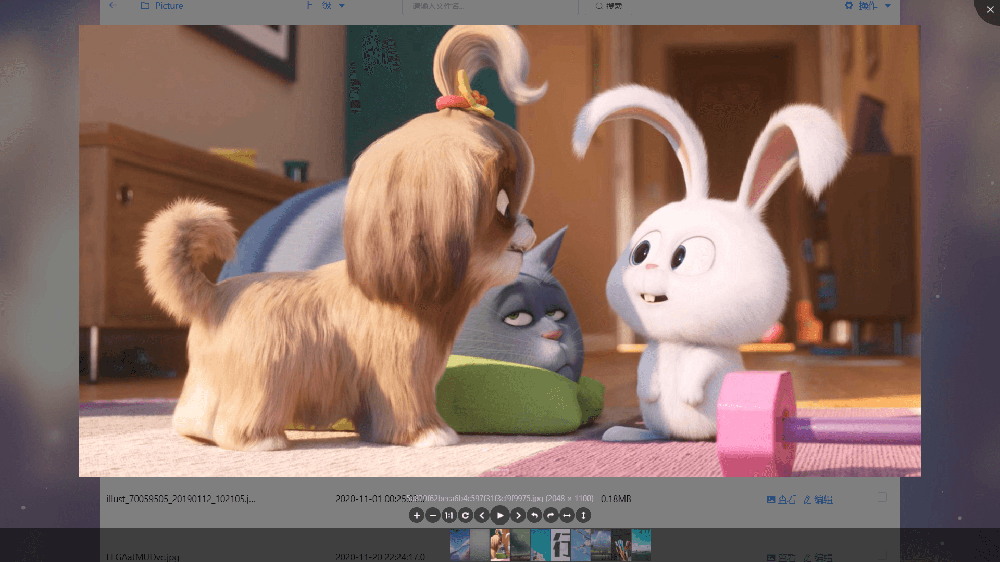

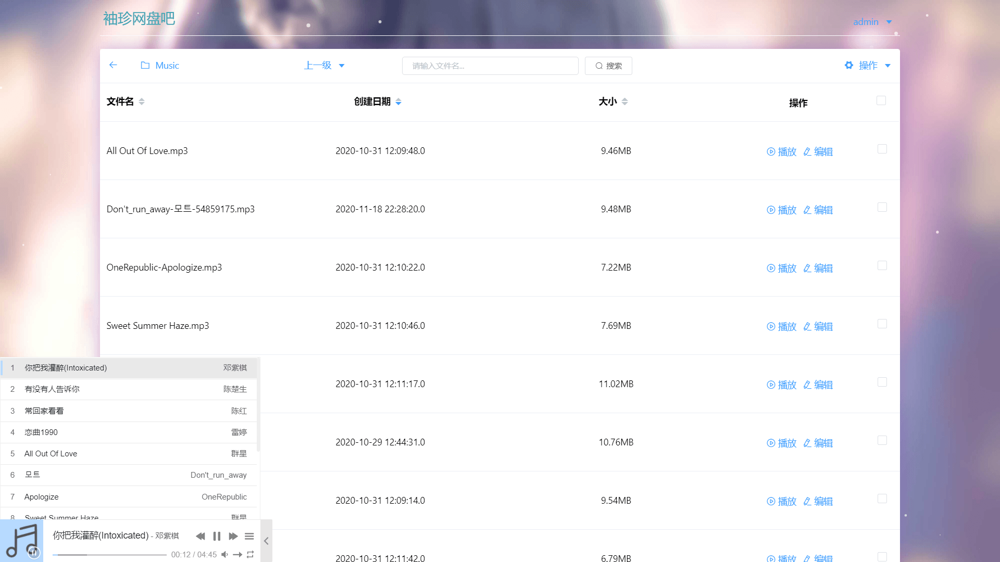

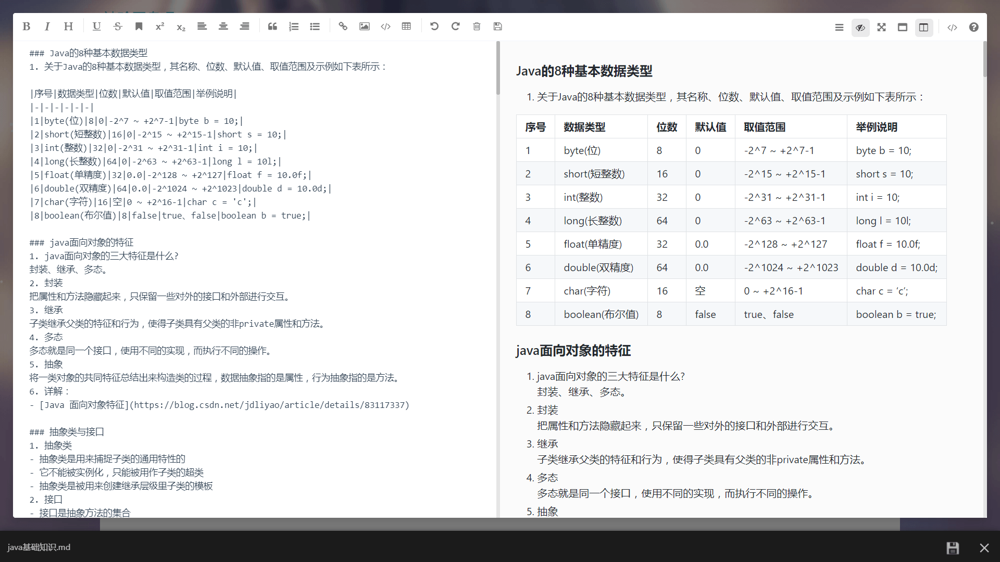

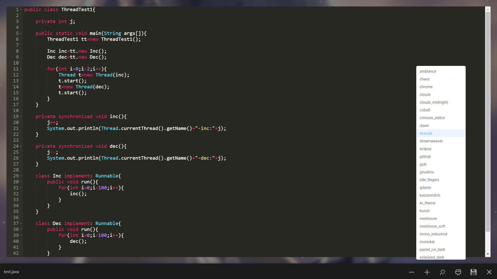

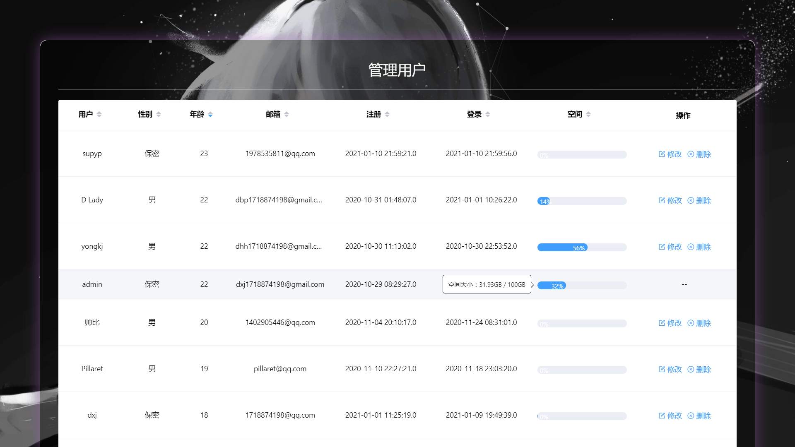

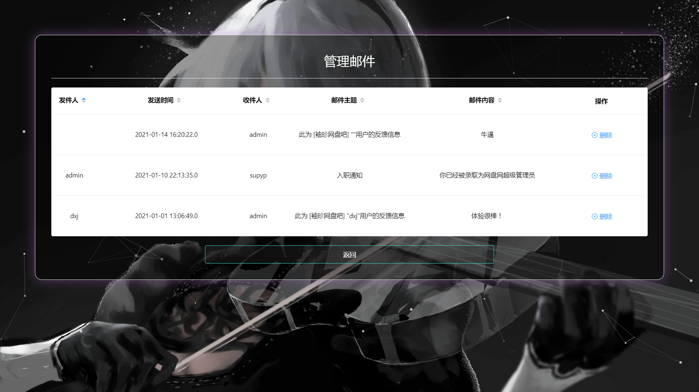

#### 技术栈
HTML+CSS+JS+Vue+Element UI

1.  本系统采用前后端分离的开发方式，彼此之间通过json数据进行交互
2.  前端采用Vue全家桶开发（vue-cli + vue2.6 + vuex + vue-router + axios），响应式框架采用element-ui桌面端组件库
3.  本项目使用了多个开源项目，主要有particles.js（轻量级粒子背景库）、Viewer.js（强大的图片查看器）、APlayer（超级好看的 HTML5 音乐播放器）、DPlayer（支持弹幕的 HTML5 视频播放器）、Ace（基于浏览器的代码编辑器）
4.  使用基于 Vue 的开源 Markdown 编辑器 mavonEditor 实现 md 的查看与编辑功能
5.  利用 NProgress 轻量级的进度条组件提升使用体验，在上传文件或获取后台数据的过程中将在网页顶部显示绿色的进度条

#### 功能特性

1.  需要使用邮箱地址并获取邮箱验证码才能注册新账号，忘记密码也可使用邮箱验证码来重置密码，另外，管理员账号可以对用户账号进行管理
2.  每个用户的初始空间大小为1GB，当执行上传文件、删除文件或编辑文本文件的操作后，用户当前可使用的空间大小就会得到更新
3.  可对文件和文件夹进行基本的一些操作，可以新建文件夹，文件夹重命名，删除文件夹，也可以上传文件，下载文件（点击文件名即可下载文件），文件重命名，删除文件
4.  可以发送文件下载链接（http或者https链接）到服务器上，实现文件的离线下载
5.  文件批量管理功能，批量移动文件或文件夹，批量删除文件或文件夹，批量上传文件
6.  文件排序功能，可对当前目录下的文件或文件夹进行排序操作，可以按照文件名、创建日期和文件大小升序或者降序排列
7.  文件搜索功能，可对当前目录下的文件或子文件夹进行搜索操作，方便对文件或文件夹执行其他操作
8.  文件夹刷新功能，可以刷新当前目录，更新当前目录下的文件和文件夹，方便手机和电脑之间共享文件，当手机上传文件后，电脑即可刷新当前目录，查看上传的新文件
9.  文件预览功能，可以在线预览常见的媒体文件，例如浏览图片文件，播放音频文件，观看视频文件，查看文本文件等等
10. 可以查看和编辑常见的文本文件，例如可以高亮显示和编辑java文件、html文件、python文件、c文件等，此外，还专门使用mavonEditor为markdown文件提供良好的编辑体验
11. 删除的文件会保存到文件回收站中，保留的时间是7天，用户可在文件回收站中恢复或彻底删除文件。每天凌晨3点将会对回收站中的过期文件进行清理
12. 支持文件流式下载，点击文件名称即可弹出下载框，点击确定即可下载文件，另外，下载框中有文件的共享二维码，也可以复制文件的共享、下载以及资源链接
13. 用户可以将使用过程中遇到的问题进行反馈，管理员则能够通过邮件发送的方式向用户发送消息

#### 使用说明

1.  此项目为 Vue 项目，需安装 Vue CLI 3 项目脚手架以及下载 node 模块才能正常使用
2.  可在 src/store/index.js 文件中修改后台接口 IP 信息以及用户的存储空间大小
3.  如需打包部署服务器，则可以使用 yarn 或者 npm 命令打包项目
